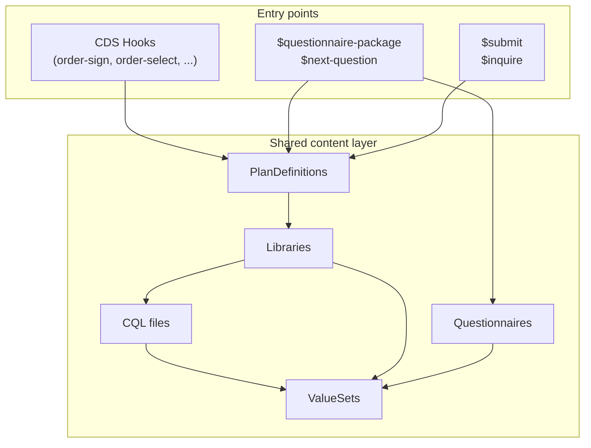

# Architecture

This page covers the code that the burden reduction implementation adds on top of HAPI FHIR JPA Starter. It does not cover HAPI internals or standard FHIR server behavior.

## CRD flow

A CDS Hooks request comes in, and the server evaluates whether any coverage rules apply:

1. A hook service (e.g., `OrderSignService`) receives the request. All hook services extend `CdsServiceBase`, which provides the template method pattern.
2. The service extracts the relevant FHIR resources from the request's prefetch and context fields.
3. `PlanDefinitionFinder` searches for matching PlanDefinitions by composite parameter: order code (from `useContext[focus]`) + payor ID (from `useContext[program]`) + hook name (from `action.trigger`). Matching is protocol-agnostic; HTTP and HTTPS URLs are treated as equivalent.
4. For each matching PlanDefinition, the server calls `PlanDefinition/$apply`, which evaluates the CQL expressions in the linked Library.
5. The `$apply` operation returns a `RequestGroup`. The card builder extracts the action titles, descriptions, and coverage information extension values to produce CDS cards.

## DTR flow

The `$questionnaire-package` operation assembles everything a DTR client needs into a single Bundle:

1. `QuestionnairePackageProvider` validates the input Parameters resource.
2. `DtrPackageService` orchestrates the pipeline. First, `DtrQuestionnaireResolver` finds the right Questionnaire. It supports two paths: canonical lookup (given a questionnaire URL directly) or PlanDefinition evaluation (given a coverage and order, find the PlanDefinition, then find its linked Questionnaire).
3. The resolver collects the Questionnaire's referenced Library resources and ValueSets.
4. `DtrSubQuestionnaireAssembler` inlines any sub-questionnaires (questionnaires referenced by other questionnaires).
5. `DtrResponseBuilder` handles CQL pre-population (running CQL expressions to fill in answers the payer already knows) and adds information-origin extensions.
6. The final Bundle contains the Questionnaire, Libraries, and ValueSets.

## PAS flow

### Submit (`$submit`)

1. `PasBundleValidator` checks the request Bundle against PAS IG structural constraints (correct profiles, required entries, reference integrity).
2. `PasBundleReferenceResolver` resolves Patient, Organization, and Coverage references from within the Bundle.
3. `PasSubmitService` detects the submission type from the Claim's structure: INITIAL (no `Claim.related`), RENEWAL/UPDATE/CANCEL (has `Claim.related`, type indicates which). This detection is structural, not profile-based.
4. The service routes to a type-specific handler. For initial submissions, `PasCoverageEvaluator` runs the same PlanDefinitions used by CRD to evaluate coverage. It maps CRD outcomes to X12 review action codes: A1 (Certified in total), A3 (Not certified), A4 (Pended).
5. `PasResponseBuilder` assembles a conformant ClaimResponse bundle with authorization numbers and review action extensions.
6. Items that evaluate as A4 (Pended) are tagged with an internal meta tag. `PasPendedResolutionService` schedules a one-time task to auto-approve the item after the configured delay (`pas.pended-resolution-delay-seconds`, default 15s).

### Inquire (`$inquire`)

`PasInquiryService` performs a query-by-example search against stored ClaimResponses. The Claim in the inquiry request is used as the search template, matching patient, provider, and service details against previously submitted authorizations.

## Data initialization

At startup, `DataInitializer` processes the directories listed in the `initial-data` configuration property:

1. Scans each directory for `.json` files and parses them as FHIR resources.
2. For Library resources with `content.url`, resolves the referenced CQL file from the same directory and compiles it to ELM using the HAPI Clinical Reasoning CQL compiler.
3. Upserts all resources into the database. The loader uses a simple retry loop to handle resources that fail to when referential integrity is enabled (as it is by default). The retry loop runs until the the number of successfully loaded resources is unchanged between loops. Check the logs for any resources that fail to load after all retries.

## How the IGs connect

CRD, DTR, and PAS are separate IGs with separate entry points, but they share the same clinical content layer:

A single PlanDefinition drives CRD cards, DTR questionnaire resolution, and PAS coverage evaluation. Writing one set of rules powers all three workflows.
